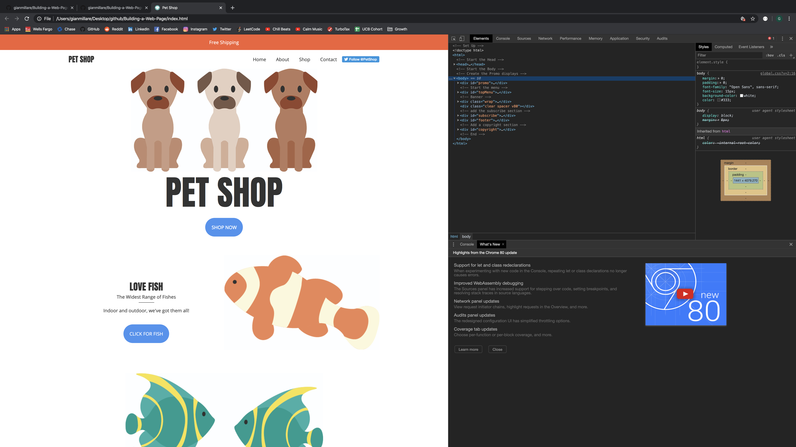
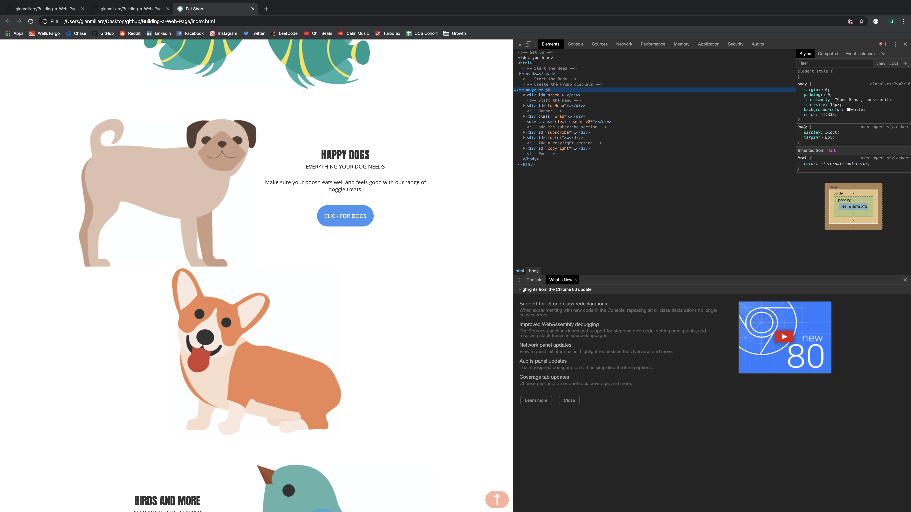
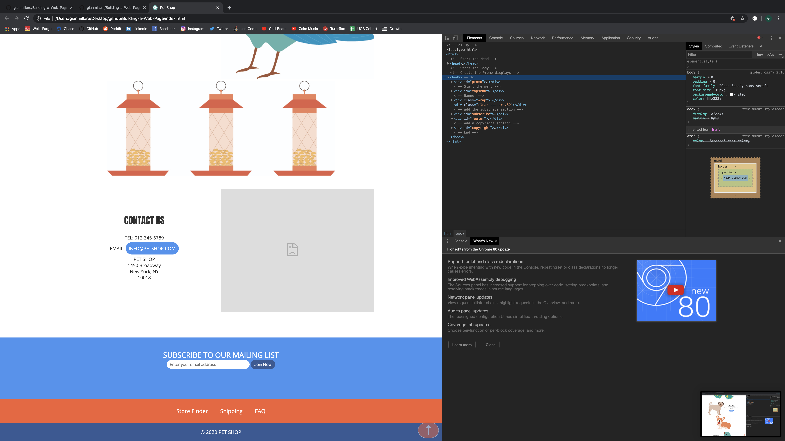
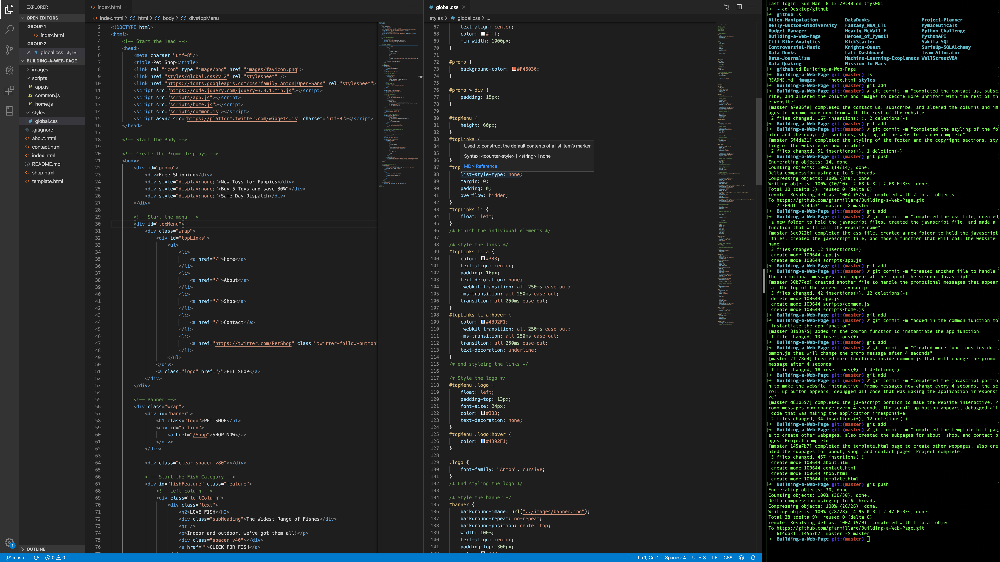
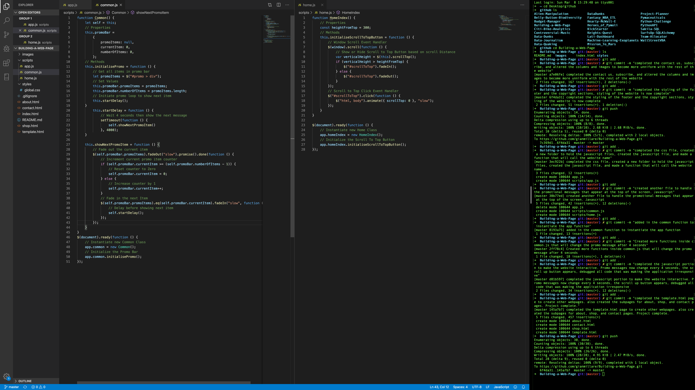

# Building-a-Web-Page

------------------------------------------------------------------------------------------------------------

Difficulty: Easy

This introductory web development project is from "Beginner's Step-by-Step Coding Course", written by DK Pub. This is a continuation of my career in software development and programming, following my graduation and certification from UC Berkeley's Data Analytics Extension Program. I felt that this project can help hone some of the fundamentals of programming in HTML, CSS, and JavaScript.

Although I have had ample experience in web-styled programming, I wanted to ensure that I absorbed all skills in web development to it's most minute detail. This mini-project's difficulty is set at beginner (easy) because most of the coding techniques and syntax is already known. However, the main objective of undergoing this project was to ensure my web development skills stay on par with what I learned through the Data Analytics program.

 

### Below are images of the website's completion. The final form of the website only involves the landing page, and uses advanced coding techniques from HTML, CSS, and Javascript. 

 

Take note that the promo messages displayed on top change every 4 seconds using Javascript.

 

The website continues adding in subsections for Birds, Fishes, and Dogs

 

The website ends with a view of the "Contact", "Subscribe", and "Copyright" Sections. Note that the "Up" arrow located at the bottom right is an added JavaScript code that allows the user to scroll to the top of the page with a click, and only appears once the user scrolls down.

 

Below is a preview of the code used in HTML and CSS

 

Below is a preview of the code used in JavaScript, making the website interactive

